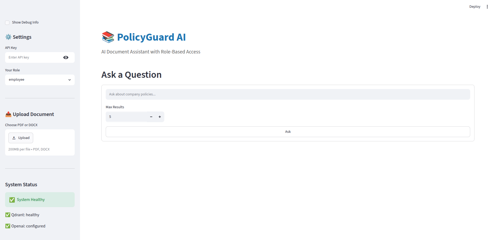
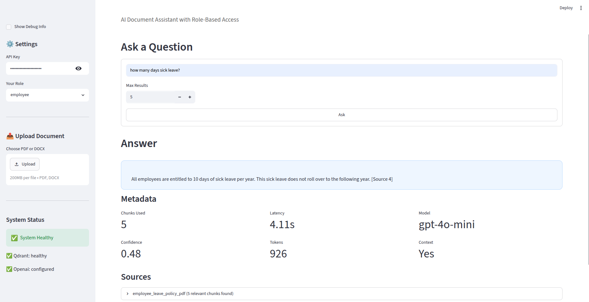
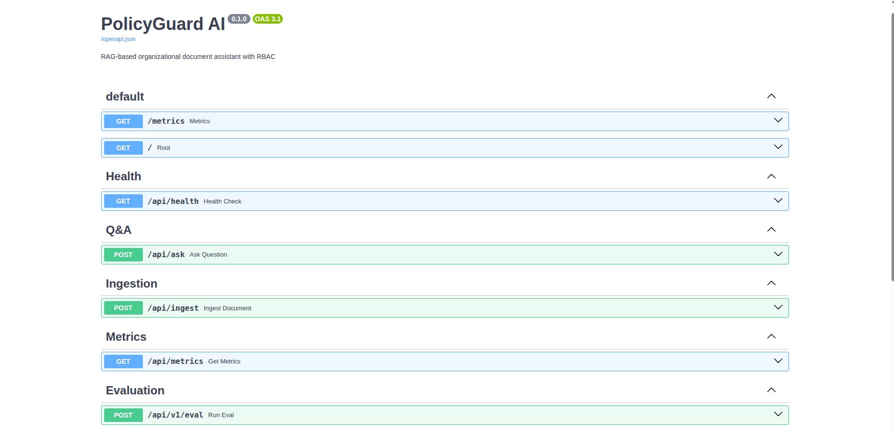
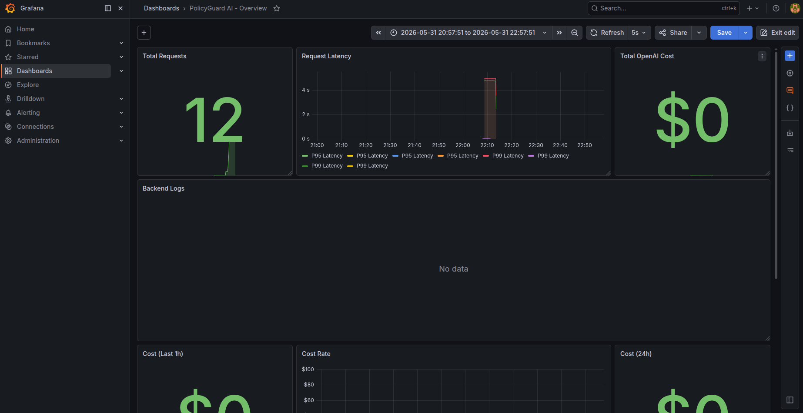
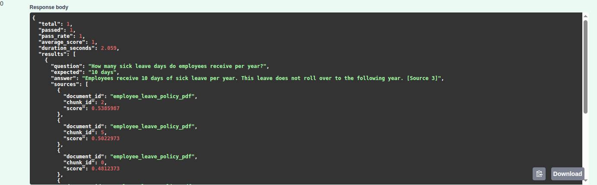

# PolicyGuard AI 

> **Production-ready RAG system for secure organizational document retrieval with Role-Based Access Control**

PolicyGuard AI is an enterprise-oriented AI assistant that enables employees to ask natural language questions about company policies while enforcing role-based access permissions and providing grounded, source-attributed answers.

[](https://github.com/Fatemeh127/policyguard-ai/actions/workflows/ci.yml)
[](https://www.python.org/downloads/)
[](https://fastapi.tiangolo.com/)
[](https://qdrant.tech/)
[](https://opensource.org/licenses/MIT)

---

## Table of Contents

- [Overview](#overview)
- [Screenshots](#screenshots)
- [Key Engineering Highlights](#key-engineering-highlights)
- [Architecture](#architecture)
- [Features](#features)
- [Tech Stack](#tech-stack)
- [Project Structure](#project-structure)
- [Quick Start](#quick-start)
- [Environment Variables](#environment-variables)
- [API Reference](#api-reference)
- [Evaluation Framework](#evaluation-framework)
- [Monitoring & Observability](#monitoring--observability)
- [Testing](#testing)
- [Performance](#performance)
- [Production Deployment](#production-deployment)
- [Roadmap](#roadmap)
- [Author](#author)

---

## Overview

PolicyGuard AI solves a real enterprise problem: employees need fast, accurate answers from large volumes of policy documents, but different roles should only access content they're authorized to see.

The system combines semantic vector search with an LLM generation layer, wrapped in a secure RBAC model. Every answer is grounded in retrieved source documents — the system explicitly refuses to answer when no relevant context is found, preventing hallucination.

**Who is this for?**

| User | Use Case |
|------|----------|
| Employees | Query HR policies, leave entitlements, office procedures |
| Managers | Access leadership guides and escalation procedures |
| Admins | Full document access and system management |

---

## Screenshots

### Streamlit UI — Main Interface
> Role-aware document assistant with API key authentication, document upload, and system health status.



---

### Ask a Question — Answer with Source Attribution
> Natural language query returns a grounded answer with metadata: chunks used, latency, model, confidence score, token count, and source documents.



---

### Swagger API Documentation
> Interactive OpenAPI 3.1 docs showing all endpoints: health check, Q&A, ingestion, metrics, and evaluation.



---

### Grafana Monitoring Dashboard
> Real-time observability: total requests, P95/P99 request latency, OpenAI cost tracking, cost rate over time, and live backend logs.



---

### RAG Evaluation Pipeline Output
> Automated evaluation result showing pass rate, average score, and per-question answer quality with source attribution scores.



---

## Key Engineering Highlights

- **Production-style RAG architecture** — ingestion pipeline, vector retrieval, and grounded generation as separate, testable layers
- **Role-Based Access Control (RBAC)** — Qdrant filters enforce access at the vector search level, not just at the API layer
- **Hallucination prevention** — system returns a safe fallback when retrieved chunk scores fall below a minimum relevance threshold
- **Full observability stack** — Prometheus metrics, Loki log aggregation, and Grafana dashboards out of the box
- **Automated RAG evaluation pipeline** — measures pass rate, average score, answer correctness, and source grounding per question
- **OpenAI cost tracking** — per-request token counting with running cost totals stored in Redis
- **Rate limiting** — SlowAPI + Redis enforces 10 requests/minute per user on the ask endpoint
- **API key authentication** — role-verified keys prevent privilege escalation
- **Dockerized multi-service deployment** — single `docker compose up` starts all 8 services

---

## Architecture

```
                    ┌─────────────────┐
                    │   Streamlit UI  │
                    └────────┬────────┘
                             │ HTTP
                             ▼
                    ┌─────────────────┐
                    │ FastAPI Backend │
                    │  Rate Limiting  │
                    │  Auth / RBAC    │
                    └────────┬────────┘
                             │
          ┌──────────────────┼──────────────────┐
          ▼                  ▼                  ▼
 ┌──────────────┐   ┌────────────────┐  ┌─────────────┐
 │    Qdrant    │   │     Redis      │  │ OpenAI API  │
 │ Vector Store │   │ Metrics/Cache  │  │ Embed + LLM │
 └──────────────┘   └────────────────┘  └─────────────┘
          │
 ┌────────▼──────────────────────────┐
 │        Observability Stack        │
 │   Prometheus → Grafana ← Loki     │
 └───────────────────────────────────┘
```

### RAG Pipeline

```
Document Upload
      │
      ▼
Text Extraction (PDF / DOCX)
      │
      ▼
Recursive Chunking (1000 chars, 200 overlap)
      │
      ▼
OpenAI Embeddings (text-embedding-3-small, 1536 dims)
      │
      ▼
Qdrant Upsert (with role + document_id metadata)
      │
      ▼
[At query time]
      │
User Query → Embed → Vector Search (filtered by role)
      │
      ▼
Top-K Chunks → Score Threshold Check
      │
      ├─ Below threshold → Safe fallback (no hallucination)
      │
      └─ Above threshold → GPT → Grounded Answer + Sources
```

---

## Features

### Retrieval-Augmented Generation
- Semantic vector search — finds answers by meaning, not keyword matching
- Score-based relevance filtering — rejects low-confidence chunks
- Multi-document retrieval with source attribution
- Context-grounded generation via structured system prompts

### Role-Based Access Control
Roles: `employee` | `manager` | `admin`

Access is enforced at the Qdrant query level using metadata filters — not just at the API layer. A user cannot retrieve chunks tagged for a higher role even with a crafted request.

### Document Ingestion
Supported formats: PDF, DOCX

Processing steps:
1. Extract text (PyMuPDF / python-docx)
2. Recursive chunking with configurable size and overlap
3. Generate embeddings via OpenAI
4. Upsert to Qdrant with role and document metadata
5. Auto-load sample documents on backend startup

### Evaluation Framework

| Metric | Description |
|--------|-------------|
| Pass Rate | Percentage of questions answered correctly |
| Average Score | Mean quality score across all evaluated questions |
| Answer Correctness | Whether the answer matches expected content |
| Source Grounding | Whether answer is supported by retrieved chunks |
| Latency | End-to-end response time per query |

### Security
- API key authentication with role binding
- Rate limiting: 10 requests/minute per user (SlowAPI + Redis)
- Role spoofing prevention — authenticated role overrides claimed role
- File type validation (PDF and DOCX only)
- No API key exposure in logs

---

## Tech Stack

| Layer | Technology | Notes |
|-------|------------|-------|
| **Backend** | FastAPI + Uvicorn | Async, dependency injection |
| **Frontend** | Streamlit | Role-aware UI |
| **Vector DB** | Qdrant | RBAC via metadata filters |
| **Embeddings** | OpenAI text-embedding-3-small | 1536 dims |
| **LLM** | OpenAI GPT-4o-mini | Temperature=0 for deterministic answers |
| **Memory/Cache** | Redis | Metrics, rate limiting |
| **Monitoring** | Prometheus + Grafana | Custom dashboards |
| **Logging** | Loki + Promtail | Structured log aggregation |
| **Auth** | API keys + JWT-ready | python-jose, passlib/bcrypt |
| **Deployment** | Docker Compose | 8-service stack |
| **CI/CD** | GitHub Actions | Lint, test, Docker build |
| **Testing** | pytest + pytest-cov | Unit and integration tests |

---

## Project Structure

```
policyguard-ai/
├── app/
│   ├── api/
│   │   ├── main.py               # FastAPI app, middleware, startup
│   │   └── routes/
│   │       ├── ask.py            # RAG Q&A endpoint (rate limited)
│   │       ├── ingest.py         # Document upload endpoint
│   │       ├── health.py         # Health check
│   │       └── metrics.py        # Usage and cost metrics
│   ├── core/
│   │   ├── config.py             # Pydantic settings
│   │   ├── logging.py            # Structured logging setup
│   │   ├── security.py           # API key auth, JWT utilities
│   │   ├── dependencies.py       # FastAPI dependency injection
│   │   ├── rate_limiter.py       # SlowAPI + Redis rate limiting
│   │   └── startup.py            # Auto-load sample documents
│   ├── ingestion/
│   │   ├── loaders/
│   │   │   ├── pdf_loader.py     # PyMuPDF text extraction
│   │   │   └── docx_loader.py    # python-docx extraction
│   │   ├── chunkers/
│   │   │   ├── simple_chunker.py
│   │   │   └── recursive_chunker.py
│   │   └── pipeline.py           # End-to-end ingestion pipeline
│   ├── retrieval/
│   │   ├── embeddings.py         # OpenAI embedding client
│   │   └── vector_store.py       # Qdrant CRUD + RBAC search
│   ├── llm/
│   │   ├── answer_service.py     # GPT generation with safe fallback
│   │   └── prompts.py            # Centralized prompt templates
│   ├── observability/
│   │   ├── usage_tracker.py      # Redis-backed token/cost tracking
│   │   └── prometheus_metrics.py # Custom Prometheus metrics
│   ├── eval/
│   │   └── evaluation.py         # RAG evaluation pipeline
│   ├── schemas/                  # Pydantic request/response models
│   └── tests/
│       ├── test_pdf_loader.py
│       ├── test_docx_loader.py
│       ├── test_chunking.py
│       ├── test_filters.py
│       ├── test_safe_answer.py
│       └── test_ask_api.py
├── ui/
│   └── streamlit_app.py
├── observability/
│   ├── prometheus.yml
│   ├── loki-config.yml
│   ├── promtail-config.yml
│   └── grafana-datasources.yml
├── data/
│   └── sample_docs/              # Auto-loaded on startup
├── docs/                         # Screenshots
│   ├── streamlit_ui.png
│   ├── askquestion-streamlit.png
│   ├── api.png
│   ├── grafana_dashboard.png
│   └── evaluation.png
├── scripts/
│   ├── ingest_sample_docs.py
│   └── reload_samples.py
├── .github/workflows/
│   └── ci.yml
├── docker-compose.yml
├── Dockerfile
├── pyproject.toml
└── .env.example
```

---

## Quick Start

### Prerequisites

- Python 3.11+
- Docker and Docker Compose
- OpenAI API key

### 1. Clone the Repository

```bash
git clone https://github.com/Fatemeh127/policyguard-ai.git
cd policyguard-ai
```

### 2. Configure Environment

```bash
cp .env.example .env
# Edit .env and add your OPENAI_API_KEY
```

### 3. Start All Services

```bash
docker compose up --build -d
docker compose ps   # all should show "Up (healthy)"
```

### 4. Access the Application

| Service | URL | Credentials |
|---------|-----|-------------|
| Streamlit UI | http://localhost:8501 | — |
| Swagger Docs | http://localhost:8000/docs | — |
| Grafana | http://localhost:3000 | admin / admin |
| Prometheus | http://localhost:9090 | — |
| Qdrant Dashboard | http://localhost:6333/dashboard | — |

Sample documents in `data/sample_docs/` are automatically ingested on first startup — ask questions immediately without uploading anything.

### 5. Ask Your First Question

```bash
curl -X POST http://localhost:8000/api/ask \
  -H "Content-Type: application/json" \
  -H "X-API-Key: demo-employee-key" \
  -d '{
    "query": "How many days of sick leave do employees receive?",
    "role": "employee",
    "limit": 5
  }'
```

---

## Environment Variables

| Variable | Default | Required | Description |
|----------|---------|----------|-------------|
| `OPENAI_API_KEY` | — | ✅ | OpenAI API key |
| `QDRANT_URL` | `http://localhost:6333` | | Qdrant server URL |
| `QDRANT_COLLECTION_NAME` | `policyguard_docs` | | Vector collection name |
| `REDIS_URL` | `redis://localhost:6379` | | Redis server URL |
| `SECRET_KEY` | (default provided) | | JWT signing key — change in production |
| `API_AUTH_ENABLED` | `true` | | Set `false` to disable auth in development |
| `FORCE_RELOAD_SAMPLES` | `false` | | Set `true` to re-ingest sample docs on startup |
| `ENVIRONMENT` | `development` | | `development` or `production` |
| `LOG_LEVEL` | `INFO` | | `DEBUG`, `INFO`, `WARNING`, or `ERROR` |

---

## API Reference

### Authentication

Pass your API key in the `X-API-Key` header.

| Key | Role | Access |
|-----|------|--------|
| `demo-employee-key` | employee | General documents |
| `demo-manager-key` | manager | Employee + manager documents |
| `demo-admin-key` | admin | All documents |

### Endpoints

#### `POST /api/ask` — Rate limit: 10 req/min

```json
// Request
{
  "query": "How many days of sick leave do employees receive per year?",
  "role": "employee",
  "limit": 5
}

// Response
{
  "answer": "All employees are entitled to 10 days of sick leave per year. This sick leave does not roll over to the following year.",
  "sources": [
    { "document_id": "employee_leave_policy_pdf", "chunk_id": 2, "score": 0.54 }
  ],
  "context_used": true,
  "metadata": {
    "num_chunks_used": 5,
    "model": "gpt-4o-mini",
    "latency_seconds": 4.11,
    "tokens": 926
  }
}
```

#### `POST /api/ingest` — Rate limit: 5 req/hour

```bash
curl -X POST http://localhost:8000/api/ingest \
  -H "X-API-Key: demo-admin-key" \
  -F "file=@handbook.pdf" \
  -F "document_id=handbook_2024" \
  -F "role=employee"
```

#### `GET /api/health` — System component health check

#### `GET /api/metrics` — Usage statistics and cost tracking

#### `POST /api/v1/eval` — Run RAG evaluation pipeline

#### `GET /metrics` — Prometheus metrics endpoint

---

## Evaluation Framework

```bash
curl -X POST http://localhost:8000/api/v1/eval \
  -H "X-API-Key: demo-admin-key"
```

Sample output:

```json
{
  "total": 1,
  "passed": 1,
  "pass_rate": 1.0,
  "average_score": 1.0,
  "duration_seconds": 2.059,
  "results": [
    {
      "question": "How many sick leave days do employees receive per year?",
      "expected": "10 days",
      "answer": "Employees receive 10 days of sick leave per year. This leave does not roll over to the following year.",
      "sources": [
        { "document_id": "employee_leave_policy_pdf", "chunk_id": 2, "score": 0.54 }
      ]
    }
  ]
}
```

---

## Monitoring & Observability

Dashboard panels visible in Grafana:

- **Total Requests** — running counter of all API calls
- **Request Latency** — P95 and P99 latency time series
- **Total OpenAI Cost** — cumulative USD spend
- **Cost Rate / Cost (Last 1h / 24h)** — time-windowed cost breakdown
- **Backend Logs** — live log stream via Loki

Access at http://localhost:3000 (admin / admin).

---

## Testing

```bash
pip install -e ".[dev]"
pytest app/tests/ -v
pytest app/tests/ -v --cov=app --cov-report=html
```

| Test File | What It Tests |
|-----------|---------------|
| `test_pdf_loader.py` | PDF text extraction, error handling |
| `test_docx_loader.py` | DOCX text extraction, error handling |
| `test_chunking.py` | Chunk size, overlap, empty input |
| `test_filters.py` | RBAC role filtering in Qdrant |
| `test_safe_answer.py` | Fallback behavior, hallucination prevention |
| `test_ask_api.py` | API endpoints, auth, response format |

---

## Performance

| Stage | Latency |
|-------|---------|
| Embedding generation | ~100ms |
| Qdrant vector search | ~50ms |
| GPT-4o-mini generation | ~2.0s |
| **End-to-end P50** | **~2.3s** |
| End-to-end P95 | ~4.1s |
| End-to-end P99 | ~6.2s |

Cost estimate: ~$2.20 per 1,000 queries.

---

## Production Deployment

```
Internet → Nginx (TLS termination)
               │
               ▼
          FastAPI (multiple workers)
               │
        ┌──────┴────────┐
        ▼               ▼
     Qdrant           Redis
```

Deployment targets: AWS EC2, Azure VM, Google Cloud VM, any Docker host.

---

## Roadmap

- [ ] Hybrid search (dense + sparse / BM25)
- [ ] Reranking layer (cross-encoder)
- [ ] Multi-turn conversation with session history
- [ ] Citation highlighting in UI
- [ ] SSO authentication (OAuth2 / OIDC)
- [ ] Kubernetes deployment manifests
- [ ] Multi-tenant architecture
- [ ] Support for TXT, Markdown, and CSV ingestion
- [ ] Query result caching

---

## License

MIT License — see [LICENSE](LICENSE) for details.

---

## Author

**Fatemeh Abidizadegan** — AI Engineer

- GitHub: [@Fatemeh127](https://github.com/Fatemeh127)

---

*If you find this project useful, consider giving it a ⭐*
